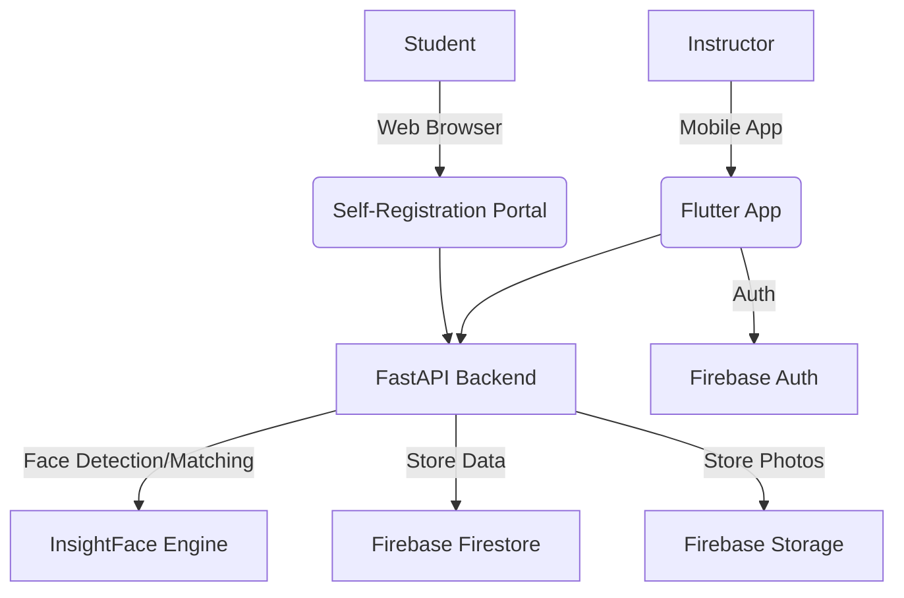

# Automated Classroom Attendance System

A state-of-the-art attendance management system using **Deep Learning (Face Recognition)**, **FastAPI**, **Flutter**, and **Azure Kubernetes Service (AKS)**.

## 🚀 Deployment Status
The system is fully containerized and deployed on **Microsoft Azure**.

*   **API Base URL:** `http://172.188.248.41`
*   **Student Registration Portal:** `http://172.188.248.41/register`
*   **Infrastructure:** Azure Kubernetes Service (AKS)
*   **Database & Auth:** Google Firebase (Firestore & Auth)

---

## 🌟 Key Features

### 1. Student Self-Registration (Web)
*   Responsive web portal for students to enroll.
*   Automated face embedding extraction using **InsightFace**.
*   **Case-Insensitive** roll number management.
*   Duplicate registration prevention.

### 2. Intelligent Attendance Capture (Mobile)
*   Built with **Flutter** for cross-platform performance.
*   Batch face detection in crowded classrooms using **SCRFD**.
*   High-accuracy matching via **ArcFace** (512-d embeddings).
*   **Real-time Image Quality Assessment**: Checks for blur, lighting, and contrast before processing.

### 3. Admin & Instructor Dashboard
*   **Admin**: Manage classes, instructors, and view global attendance logs.
*   **Instructor**: Capture attendance, review/correct AI matches, and track history.

---

## 🛠 Tech Stack

### Backend (Python/FastAPI)
*   **InsightFace**: Using the `buffalo_l` model for state-of-the-art face analysis.
*   **OpenCV**: Image preprocessing (CLAHE, denoising, exposure correction).
*   **Docker**: Multi-stage build for optimized image size.

### Mobile (Flutter/Dart)
*   **Firebase SDK**: Real-time data synchronization.
*   **Camera & Image Picker**: Optimized for high-resolution classroom captures.

### Infrastructure
*   **AKS (Azure Kubernetes Service)**: Scalable cloud orchestration.
*   **Terraform/YAML**: Infrastructure as code for deployment.

---

## 📖 How to Run / Test

### 1. Web Portal (Registration)
1.  Open `http://172.188.248.41/register` in any browser.
2.  Select a class and enter student details.
3.  Upload or take a selfie to enroll in the system.

### 2. Mobile Application
1.  Download the **`app-release.apk`** (located in `attendance_app/build/app/outputs/flutter-apk/`).
2.  Install on an Android device.
3.  **Login Credentials (Instructor):**
    *   **Email:** `instructor@test.com`
    *   **Password:** `123456`

    **Login Credentials (Admin):**
    *   **Email:** `admin@test.com`
    *   **Password:** "123456"

4.  Select a class, tap **Capture Attendance**, and process a group photo.

### 3. Local Development (Optional)
If you wish to run the backend locally:
```bash
cd backend
python -m venv venv
source venv/bin/activate
pip install -r requirements.txt
python main.py
```
*Note: Requires `firebase-credentials.json` in the backend root.*

---

## 📐 Architecture Diagram


